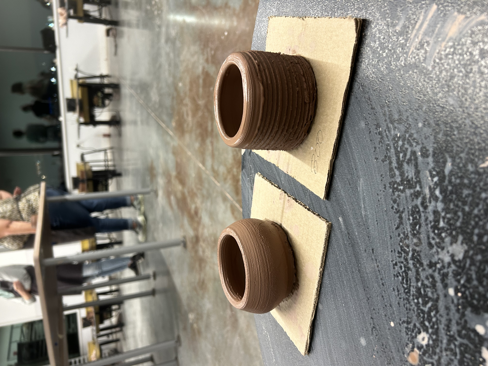

# From Skeptic to Supporter: My DH Journey
I have to be completely honest–coming into this class I was a full-on DH skeptic! As an engineering student, I saw the digital and technology side as living in one world and the humanities in another, and just couldn’t fully see the connection between the two. But now, after taking this class, I can safely say I’ve learned more than I expected and have completely changed my perspective.

One of my key takeaways from this class was understanding the materiality of media and what is lost when we switch to digitizing it. This was something we read about and discussed at length in class, particularly through Zachary Lesser and our very own professor Whitney Trettien’s “Material/Digital.” I also experienced this first-hand in the letterpress workshop I attended, where I got to work directly with printing materials. There’s definitely something that is lost when we switch to digital versus on paper. Lesser and Trettien emphasize how digital facsimiles, while incredibly useful for accessibility and research, can never fully replicate the physical artifacts they represent. The texture, size, and even imperfections of a book or manuscript get flattened out in digital copies, which reminds me of when we went into the basement of Van Pelt Library to see the work people do to preserve media like books digitally. It’s amazing work, but I really wonder: is this ever going to be a true replacement for the real thing? Probably not. Still, it’s important to weigh the pros and cons–digital accessibility allows so many more people to engage with these materials, but something about the original materiality is irreplaceable.

This tension between digital and physical media really stuck with me throughout the class. On the one hand, digital tools let us preserve, access, and study texts in ways we never could before, but on the other, there’s a clear disconnect from the materiality of the original object. Working so much with digital artifacts and data in this class really made me appreciate that materiality even more. This became especially clear during the wheel-throwing pottery class I took at the Clay Studio for my workshop assignment. It was so rewarding to make something completely with my own two hands. That sense of tangibility–the direct connection with the medium you're shaping and creating–felt like the perfect contrast to the digital humanities work we’ve done. In the digital realm, the process of creation often feels abstract and intangible, but working with clay grounded me in a way that reminded me how important the material itself can be.

  <figure style="margin: 0;">
    
    <figcaption style="font-style: italic;">Taking the pottery wheel for a spin!</figcaption>
  </figure>
  <figure style="margin: 0;">
    
    <figcaption style="font-style: italic;">I'm so proud of the little pots I made here.</figcaption>
  </figure>

The pottery workshop experience stuck with me even more as we started talking about critical making in class. At first, I attended the clay workshop just as part of the assignment, but once we began our discussions and started the critical making project in the Education Commons, everything really clicked for me. It made me realize just how valuable critical making is, especially in the context of the digital humanities. With so much access to all this data and technology around us, it’s easy to get lost in the weeds and forget about the importance of physicality. Our sessions on critical making were incredibly insightful and showed me that even data–something that feels so inherently “tech-y” and abstract–can be represented in ways that are material, tangible, and, most importantly, interactive. The idea that technology and physicality can work together really shifted how I thought about digital projects. The concept of learning by doing, which is central to critical making, felt so familiar–it was exactly what I had experienced during the pottery workshop. Shaping the clay with my hands gave me a new appreciation for the physical process of creating something, and it was validating to later learn a term for what I had intuitively felt in that moment. I’m really grateful that this course pushed us to step out of our usual routines and attend workshops where we got to practice skills we don’t typically use, like working with our hands.

Even as I am typing this statement, the act of creating and generating text reminds me of the letterpress printing workshop I attended. Both typing on my laptop and using the letterpress achieve the same purpose, but in such different ways. Typing is quick and effortless, while the letterpress required me to be much more intentional, carefully placing each letter by hand. That workshop opened my eyes to how much history is embedded in the technology we use today. Our class often highlighted these connections, like how a laptop’s design mimics the shape of a notebook, even though most of us rarely use physical notebooks anymore. It’s fascinating how these remnants of the past resurface in modern life, and the letterpress workshop taught me how deeply text terminology and even the fonts we use today are rooted in printing traditions from hundreds of years ago. I explore this more in my reflection on the workshop, but it’s clear to me now how much history continues to influence the present, even in ways we don’t always notice.

  <figure style="margin: 0;">
    
    <figcaption style="font-style: italic;">Adventures with the printing press.</figcaption>
  </figure>
  <figure style="margin: 0;">
    
    <figcaption style="font-style: italic;">A rare press from Common Press! (peep the prison poster in the back)</figcaption>
  </figure>

Continuing on with this discussion of history, preserving history was a central theme in this class, but we focused on how to do so with care and intention. This connects deeply with our discussion about archives, something I had not fully considered until our reading of Dorothy Berry’s “The House Archives Built.” Her essay made me realize how much power archives hold, not just in preserving history, but in shaping how that history is remembered and accessed. Berry talks about how institutional archives often prioritize systems and standards over the people and stories they’re meant to represent, especially when it comes to Black history. That really stuck with me because it made me think about how preservation isn’t just about keeping history safe, it’s about how that history gets presented and who gets to tell it. It’s a complicated line to cross, and I don’t think I fully appreciated how much intentionality is required to do it right until this reading.

I’m humbled to have had the opportunity to take this class, which truly transformed my perspective on a field I knew so little about. I came in a skeptic, but I’m leaving with a deeper appreciation for history, humanity, and my connection to both.

